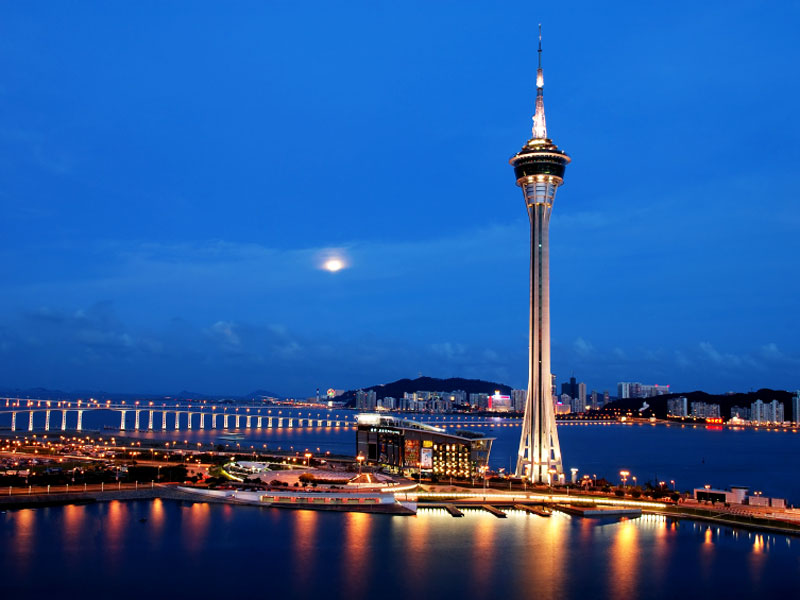

# Implementing of a Neural Algorithm of Artistic Style #

This is an implementation of the "[A Neural Algorithm of Artistic Style](http://arxiv.org/abs/1508.06576)". This uses the selected filtered responses of a pre-trained model (VGG-19) to capture low level to high level features and transfer them to the content image.

This code is documented so you can follow along while reading with the paper. You can also just replace with your own images and to generate your new painting.

Results:

Using the StarryNight:

# How to run

You will need to install dependencies:

- TensorFlow
- Scipy
- Numpy

You will need to download the VGG-19 model from Model Zoo at [https://github.com/BVLC/caffe/wiki/Model-Zoo](https://github.com/BVLC/caffe/wiki/Model-Zoo).

Then just run art.py.
